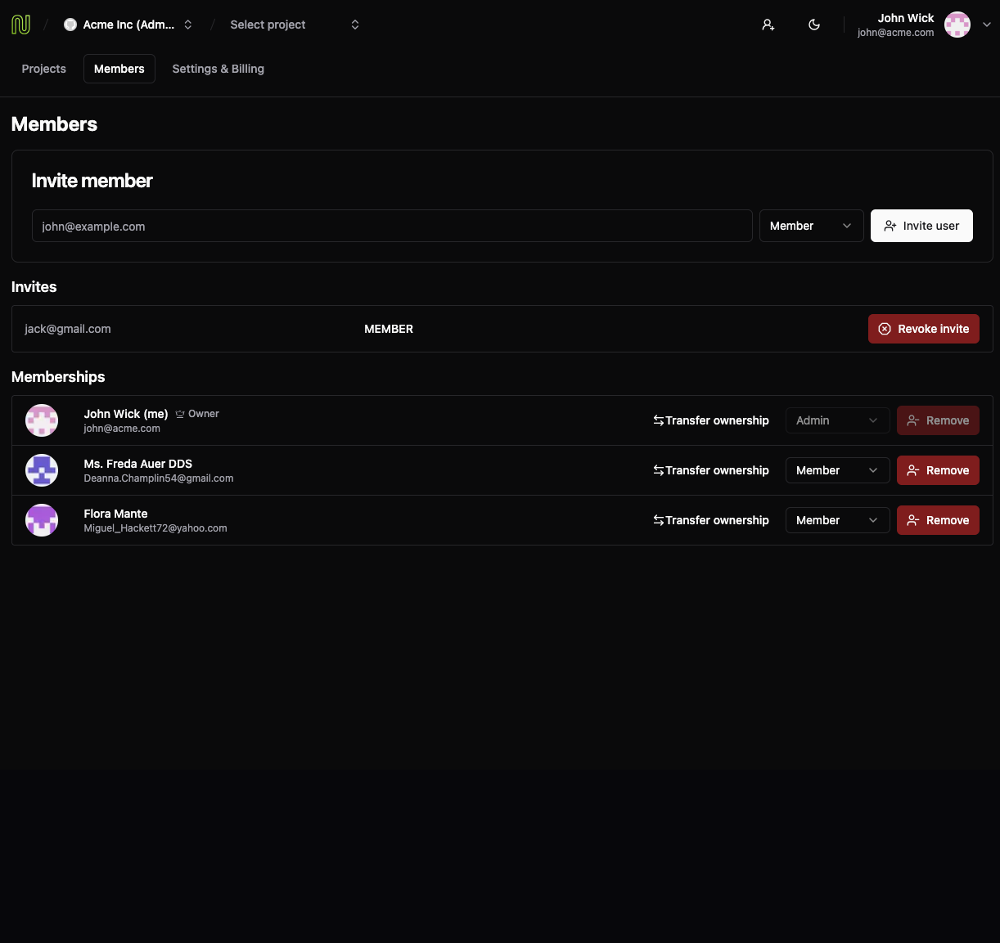
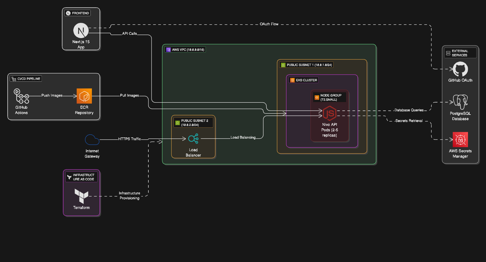
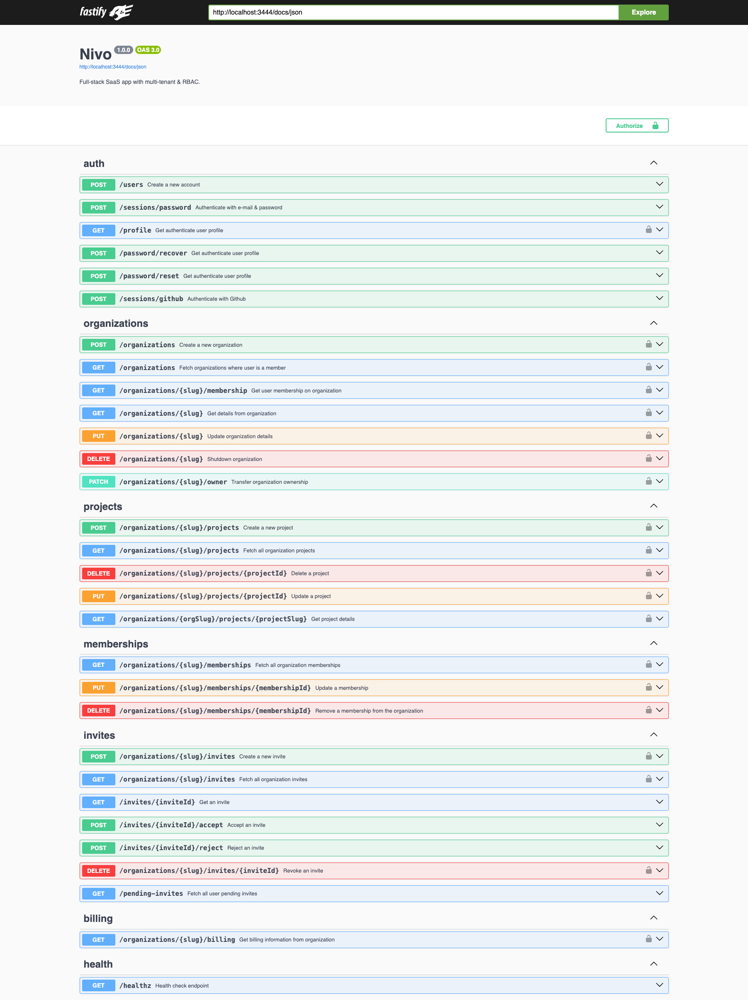

# nivo


## 🎯 Overview

**Nivo** is a multi-tenant SaaS platform featuring organization management, project collaboration, and enterprise-grade security. Built with modern technologies and deployed on AWS EKS with full CI/CD automation.

### ✨ Key Features

| Feature | Description | Business Value |
|---------|-------------|----------------|
| **Multi-Tenant Organizations** | Domain-based user attachment with custom branding | Scalable B2B SaaS model |
| **Advanced RBAC** | Three-tier permission system (ADMIN, MEMBER, BILLING) | Enterprise security compliance |
| **Project Management** | Owner-based access controls with team collaboration | Enhanced productivity |
| **Team Collaboration** | Invitation system with role-based access | Streamlined onboarding |
| **Dual Authentication** | GitHub OAuth + email/password | Flexible user access |
| **Billing System** | Cost calculation and tracking | Revenue monitoring ready |

## 🏗️ Architecture

### 📁 Monorepo Structure
```
nivo/
├── apps/
│   ├── api/     # Fastify REST API with OpenAPI
│   └── web/     # Next.js 15 App Router frontend
├── packages/
│   ├── auth/    # Shared CASL authorization
│   └── env/     # Type-safe environment management
├── iac/         # Terraform infrastructure
└── .github/     # CI/CD with OIDC
```

### 🛠️ Technology Stack

| **Frontend** | **Backend** | **Infrastructure** |
|------------------|-----------------|----------------------|
| Next.js 15 + React 19 RC | Fastify + TypeScript + Prisma ORM | Kubernetes (EKS) with auto-scaling |
| Radix UI + Tailwind CSS | PostgreSQL with advanced indexing | Terraform IaC with remote state |
| TanStack Query + Intercepting Routes | JWT authentication + OpenAPI documentation | Docker multi-stage builds |
| Dark/light theme system | Zod validation + CASL authorization | GitHub Actions CI/CD with OIDC |
| TypeScript + ESLint + Prettier | Health checks + Error handling | AWS: ECR, EKS, VPC, Secrets Manager |

### 🗄️ Database Design

*PostgreSQL database with optimized schema for multi-tenant SaaS operations, featuring role-based access control, project management, and billing tracking.*

## 📱 App Experience

### 🏗️ Projects Dashboard

*Central hub for project management with card-based layout, owner information, and creation timestamps. Features role-based access controls and seamless project creation workflow.*

---

### 👥 Team Management

*Comprehensive member management with role-based permissions, active invites system, and ownership transfer capabilities. Includes avatar display and granular access controls.*

---

### 💳 Billing & Analytics

*Transparent cost calculation showing project and seat-based pricing ($20/project, $10/seat). Real-time usage tracking with detailed breakdown and totals.*

## ☁️ Infrastructure

*Complete end-to-end architecture showing user flow from Next.js frontend through EKS auto-scaling API pods to PostgreSQL database, with GitHub Actions CI/CD pipeline, AWS Secrets Manager integration, and Terraform infrastructure automation.*

## 🔐 Security

### 🛡️ Simple & Powerful Authorization

The CASL-based authorization system is **extremely easy to use and extend**:

```typescript
// ✅ Create ability for any user - works everywhere!
const ability = defineAbilityFor({ id: userId, role: 'MEMBER' })

// ✅ Check permissions with simple API
if (ability.can('update', 'Project', { ownerId: user.id })) {
  // User can update this specific project
}

if (ability.can('transfer_ownership', organization)) {
  // Show transfer ownership button
}

// ✅ Conditional UI based on permissions
{ability.can('delete', 'User') && (
  <Button>Remove Member</Button>
)}

// ✅ Adding new permissions is trivial
MEMBER(user, { can }) {
  can('create', 'Project')
  can('update', 'Project', { ownerId: { $eq: user.id } })
  // ✨ New permission: just one line!
  can('invite', 'Project', { ownerId: { $eq: user.id } })
}
```

**Why is it so easy?**
- **One API**: Same `defineAbilityFor()` works in any app
- **Reusable**: Same rules work everywhere (frontend, backend, server actions)
- **Extensible**: Add new permissions without breaking existing ones
- **Type-safe**: TypeScript ensures you don't make mistakes

### 🔒 Security Features Matrix

| Security Layer | Implementation | Business Benefit |
|----------------|----------------|------------------|
| **Authentication** | GitHub OAuth + Email/Password | Flexible user access |
| **Authorization** | CASL-based RBAC with 3 roles | Enterprise compliance |
| **Data Protection** | JWT with secure expiration | Session security |
| **Container Security** | Non-root users, read-only filesystems | Runtime protection |
| **Network Security** | Kubernetes Network Policies | Micro-segmentation |
| **Secrets Management** | AWS Secrets Manager integration | Centralized credential management |


## 📊 API & Development

### 🔌 RESTful API with OpenAPI



```typescript
// Type-safe route definitions with Zod validation
app.post('/organizations/:slug/projects', {
  schema: {
    body: z.object({ name: z.string(), description: z.string() }),
    response: { 201: z.object({ projectId: z.string().uuid() }) }
  }
}, async (request, reply) => {
  // Implementation with authorization checks
})
```

### 🛠️ API Features Matrix

| Feature | Technology | Business Value |
|---------|------------|----------------|
| **Type Safety** | Zod schemas + TypeScript | Reduced bugs, better DX |
| **Documentation** | OpenAPI + Swagger UI | Developer onboarding |
| **Authentication** | JWT middleware | Secure API access |
| **Validation** | Request/response schemas | Data integrity |

## 🚀 Getting Started

### 🛠️ Developer Experience

**Modern development workflow with excellent tooling:**

- **Monorepo**: Turbo build system for fast, efficient builds
- **Shared Packages**: Reusable auth and environment management  
- **Type-safe Configuration**: End-to-end TypeScript validation
- **Docker Compose**: One-command local development setup
- **Prisma Studio**: Visual database management
- **Interactive API Docs**: Swagger UI at `/docs` endpoint
- **CI/CD Pipeline**: Automated testing, quality checks, and security scanning

### 📋 Prerequisites

| Tool | Version | Purpose |
|------|---------|---------|
| **Node.js** | 18+ | Runtime environment |
| **Docker** | Latest | Containerization |
| **Docker Compose** | Latest | Local development |
| **AWS CLI** | Latest | Production deployment |

### 🛠️ Local Development

```bash
# 1. Clone and install dependencies
git clone https://github.com/wladimirgrf/nivo.git
cd nivo
npm install

# 2. Start local database
docker-compose up -d

# 3. Run database migrations and seed
cd apps/api
npm run db:migrate
npm run db:seed

# 4. Start development servers
npm run dev

# 5. Access API documentation
# Open http://localhost:3333/docs for interactive Swagger UI
```

### ☁️ Production Deployment

> [!Important]
> _**Database Required**: You need an external hosted PostgreSQL database before deployment. Options include AWS RDS, Neon (recommended for development), or any PostgreSQL provider. Ensure connection string is available._

#### 🔐 AWS Secrets Manager Setup
```bash
# 1. Create database secret (structured format)
aws secretsmanager create-secret \
  --name "prod/nivo/postgres" \
  --secret-string '{
    "username": "your-db-username",
    "password": "your-db-password", 
    "host": "your-db-host",
    "port": "5432",
    "dbname": "your-db-name"
  }'

# 2. Create GitHub OAuth secret
aws secretsmanager create-secret \
  --name "prod/github/oauth" \
  --secret-string '{
    "github_oauth_client_id": "your-github-client-id",
    "github_oauth_client_secret": "your-github-client-secret",
    "github_oauth_client_redirect_uri": "https://your-domain.com/api/auth/callback/github"
  }'

# 3. Create app secrets
aws secretsmanager create-secret \
  --name "prod/app" \
  --secret-string '{
    "jwt_secret": "your-jwt-secret-key"
  }'
```

#### 🏗️ Terraform State Setup
```bash
# 1. Create DynamoDB table for state locking
aws dynamodb create-table \
  --table-name terraform-state-lock \
  --attribute-definitions AttributeName=LockID,AttributeType=S \
  --key-schema AttributeName=LockID,KeyType=HASH \
  --billing-mode PAY_PER_REQUEST

# 2. Create S3 bucket for state storage
aws s3 mb s3://your-terraform-state-bucket
```

#### 🔑 GitHub OIDC Setup
```bash
# 1. Create OIDC Identity Provider in AWS IAM
# 2. Create IAM Role with trust policy for GitHub Actions
# 3. Add Role ARN to GitHub Secrets:
#    - Go to Repository Settings > Secrets and Variables > Actions
#    - Add secret: AWS_OIDC_ROLE = "arn:aws:iam::ACCOUNT:role/GitHubActionsRole"
```

#### 🚀 Deploy Infrastructure
```bash
# 1. Deploy infrastructure
cd iac
terraform init
terraform apply

# 2. CI/CD handles application deployment automatically
# Push to master branch triggers full deployment pipeline
```

> [!Note]
> _All application deployment is automated via GitHub Actions with OIDC authentication._

## 📈 Performance & Scale

### 🚀 Production-Ready Architecture

| **Capability** | **Implementation** | **Business Impact** |
|----------------|-------------------|---------------------|
| **Auto-Scaling** | Kubernetes HPA (1-2 pods) | Handles traffic spikes automatically |
| **High Availability** | Multi-AZ ready deployment | Minimizes downtime and service interruptions |
| **Container Orchestration** | EKS with managed node groups | Reduces operational overhead |
| **Infrastructure as Code** | Terraform with remote state | Consistent, reproducible deployments |
| **Security Scanning** | ECR vulnerability scanning | Proactive security risk management |
| **Monitoring Ready** | Health checks and endpoints | Real-time system visibility |

### 💼 Business Value Proposition

**🎯 For Technical Leadership:**
- **Reduced Time-to-Market**: Modern stack accelerates feature development
- **Lower Operational Costs**: Auto-scaling prevents over-provisioning
- **Risk Mitigation**: Type-safe codebase reduces production bugs
- **Team Productivity**: Excellent developer experience attracts talent

**📊 For Business Stakeholders:**
- **Scalability**: Architecture supports growth from startup to enterprise
- **Compliance Ready**: Enterprise-grade security meets regulatory requirements  
- **Cost Predictability**: Transparent billing system and resource optimization
- **Competitive Advantage**: Modern tech stack enables rapid innovation

> **Built for the real world** - This isn't just a demo. It's production-ready infrastructure that scales with business needs.
