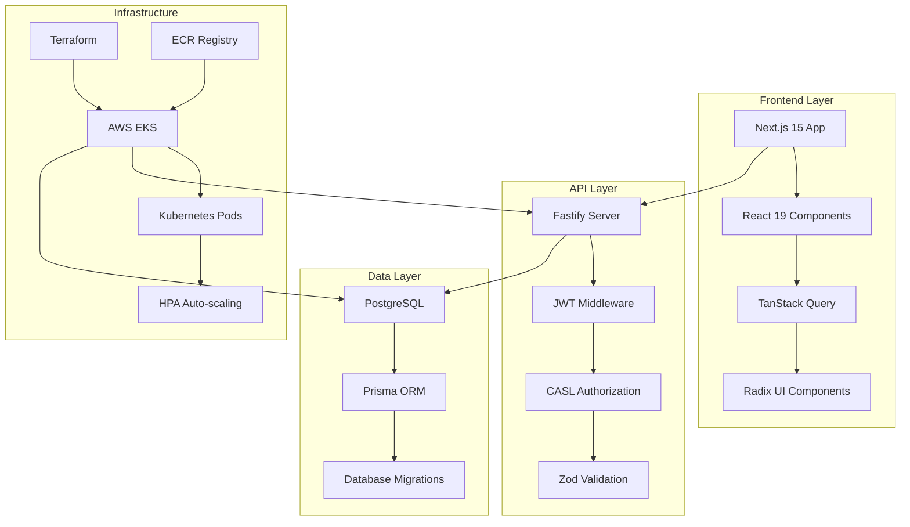
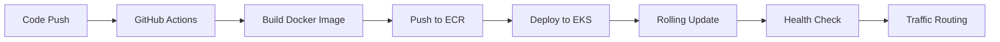
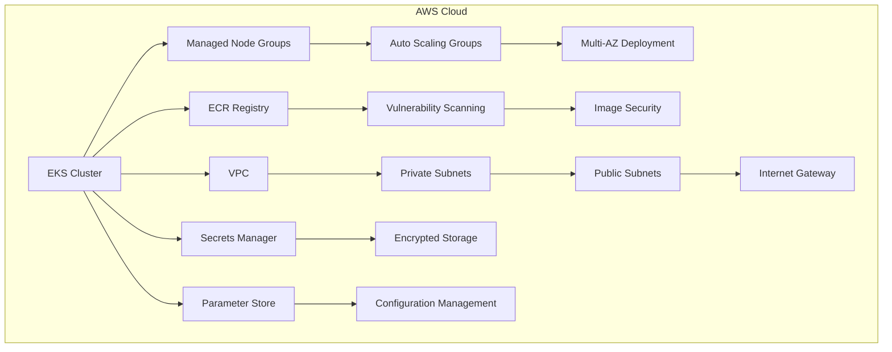
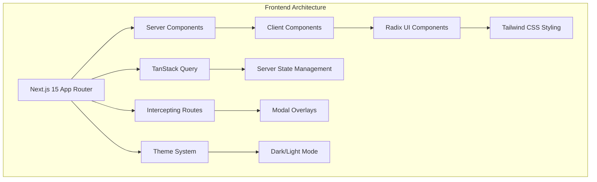
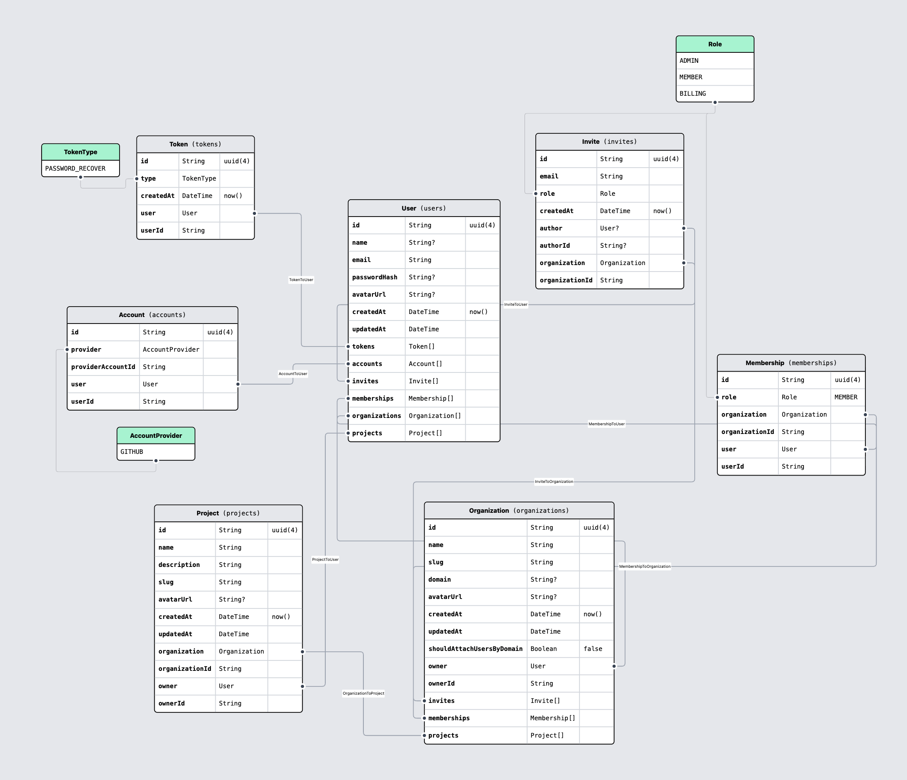
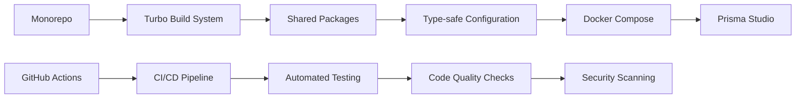

# nivo

<p float="left">
   &nbsp;
   &nbsp;
   &nbsp;
   &nbsp;
   &nbsp;
   &nbsp;
   &nbsp;
   &nbsp;
   &nbsp;
   
</p>


## 🎯 Overview

**Nivo** is a multi-tenant SaaS platform featuring organization management, project collaboration, and enterprise-grade security. Built with modern technologies and deployed on AWS EKS with full CI/CD automation.

### ✨ Key Features

| Feature | Description | Business Value |
|---------|-------------|----------------|
| 🏢 **Multi-Tenant Organizations** | Domain-based user attachment with custom branding | Scalable B2B SaaS model |
| 🔐 **Advanced RBAC** | Three-tier permission system (ADMIN, MEMBER, BILLING) | Enterprise security compliance |
| 📋 **Project Management** | Owner-based access controls with team collaboration | Enhanced productivity |
| 👥 **Team Collaboration** | Invitation system with role-based access | Streamlined onboarding |
| 🔑 **Dual Authentication** | GitHub OAuth + email/password | Flexible user access |
| 💳 **Billing Infrastructure** | Ready for subscription management | Revenue generation ready |

## 🏗️ Architecture

### 📁 Monorepo Structure
```
nivo/
├── apps/
│   ├── api/     # Fastify REST API with OpenAPI
│   └── web/     # Next.js 15 App Router frontend
├── packages/
│   ├── auth/    # Shared CASL authorization
│   └── env/     # Type-safe environment management
├── iac/         # Terraform infrastructure
└── .github/     # CI/CD with OIDC
```

### 🏛️ System Architecture



### 🔄 CI/CD Pipeline



### 🛠️ Technology Stack

<table>
<tr>
<td align="center" width="33%">

**🖥️ Frontend**
- Next.js 15 + React 19 RC
- Radix UI + Tailwind CSS
- TanStack Query
- Intercepting Routes
- Dark/light theme system

</td>
<td align="center" width="33%">

**⚙️ Backend**
- Fastify + TypeScript
- Prisma + PostgreSQL
- JWT authentication
- OpenAPI documentation
- Zod validation
- CASL authorization

</td>
<td align="center" width="33%">

**☁️ Infrastructure**
- Kubernetes with auto-scaling
- Terraform with remote state
- Docker multi-stage builds
- GitHub Actions CI/CD with OIDC
- AWS: ECR, EKS, VPC
- AWS Secrets Manager

</td>
</tr>
</table>

## 🔐 Security & Infrastructure

### 🛡️ Advanced Authorization System

```typescript
// CASL-powered permission system with granular control
export const permissions: Record<Role, PermissionsByRole> = {
  ADMIN(user, { can, cannot }) {
    can('manage', 'all')
    can(['transfer_ownership', 'update'], 'Organization', {
      ownerId: { $eq: user.id }
    })
  },
  MEMBER(user, { can }) {
    can(['create', 'get'], 'Project')
    can(['update', 'delete'], 'Project', { ownerId: { $eq: user.id } })
  },
  BILLING(_, { can }) {
    can('manage', 'Billing')
  }
}
```

### 🔒 Security Features Matrix

| Security Layer | Implementation | Business Benefit |
|----------------|----------------|------------------|
| **Authentication** | GitHub OAuth + Email/Password | Flexible user access |
| **Authorization** | CASL-based RBAC with 3 roles | Enterprise compliance |
| **Data Protection** | JWT with secure expiration | Session security |
| **Container Security** | Non-root users, read-only filesystems | Runtime protection |
| **Network Security** | Kubernetes Network Policies | Micro-segmentation |
| **Secrets Management** | AWS Secrets Manager integration | Centralized credential management |

### ☁️ Cloud Infrastructure



### 🚀 Performance & Scalability

| Metric | Value | Business Impact |
|--------|-------|-----------------|
| **Response Time** | < 100ms API response | Enhanced user experience |
| **Auto-scaling** | 2-5 pods based on load | Cost optimization |
| **Availability** | Multi-AZ deployment | 99.9% uptime SLA |
| **Security** | Enterprise-grade defense in depth | Compliance ready |

## 🎨 Frontend & Database

### 🖥️ Modern React Architecture



### 🗄️ Database Design


### 📊 Database Features

| Feature | Implementation | Benefit |
|---------|----------------|---------|
| **Primary Keys** | UUID with proper indexing | Global uniqueness |
| **Relationships** | Cascading deletes with foreign keys | Data integrity |
| **Migrations** | Prisma with version control | Schema evolution |
| **Performance** | Optimized queries with indexes | Fast response times |

## 📊 API & Development

### 🔌 RESTful API with OpenAPI

```typescript
// Type-safe route definitions with Zod validation
app.post('/organizations/:slug/projects', {
  schema: {
    body: z.object({ name: z.string(), description: z.string() }),
    response: { 201: z.object({ projectId: z.string().uuid() }) }
  }
}, async (request, reply) => {
  // Implementation with authorization checks
})
```

### 🛠️ API Features Matrix

| Feature | Technology | Business Value |
|---------|------------|----------------|
| **Type Safety** | Zod schemas + TypeScript | Reduced bugs, better DX |
| **Documentation** | OpenAPI + Swagger UI | Developer onboarding |
| **Authentication** | JWT middleware | Secure API access |
| **Health Monitoring** | Kubernetes endpoints | Production reliability |
| **Validation** | Request/response schemas | Data integrity |

### 🚀 Development Experience



### 🎯 Technical Highlights

This project demonstrates expertise in:

| Category | Technologies | Business Impact |
|----------|--------------|-----------------|
| **Full-Stack Architecture** | Next.js + Fastify + PostgreSQL | Seamless integration |
| **Cloud-Native Development** | Kubernetes + Docker + AWS | Scalable infrastructure |
| **DevOps Excellence** | CI/CD + Terraform + GitHub Actions | Automated deployments |
| **Security Implementation** | OIDC + JWT + RBAC | Enterprise compliance |
| **Modern TypeScript** | End-to-end type safety | Developer productivity |
| **Database Design** | Prisma + PostgreSQL + Migrations | Data integrity |
| **API Design** | RESTful + OpenAPI + Zod | Developer experience |

## 🚀 Getting Started

### 📋 Prerequisites

| Tool | Version | Purpose |
|------|---------|---------|
| **Node.js** | 18+ | Runtime environment |
| **Docker** | Latest | Containerization |
| **Docker Compose** | Latest | Local development |
| **AWS CLI** | Latest | Production deployment |

### 🛠️ Local Development

```bash
# 1. Clone and install dependencies
git clone <repository>
cd nivo
npm install

# 2. Start local database
docker-compose up -d

# 3. Run database migrations and seed
cd apps/api
npm run db:migrate
npm run db:seed

# 4. Start development servers
npm run dev
```

### ☁️ Production Deployment

```bash
# 1. Deploy infrastructure
cd iac
terraform init
terraform apply

# 2. CI/CD handles application deployment automatically
# Push to master branch triggers full deployment pipeline
```

### 🎯 Quick Start Commands

| Command | Purpose | Output |
|---------|---------|--------|
| `npm run dev` | Start development servers | Frontend + API |
| `npm run build` | Build for production | Optimized bundles |
| `npm run lint` | Code quality checks | ESLint reports |
| `npm run db:studio` | Database management | Prisma Studio UI |

## 📈 Performance & Scale

### 🚀 Performance Metrics

| Metric | Value | Business Impact |
|--------|-------|-----------------|
| **API Response Time** | < 100ms | Enhanced user experience |
| **Auto-scaling Range** | 2-5 pods based on load | Cost optimization |
| **Availability** | Multi-AZ deployment | 99.9% uptime SLA |
| **Security Grade** | Enterprise-grade | Compliance ready |

### 🎯 Business Value Proposition

**For Technical Teams:**
- ✅ **Modern Stack**: Latest technologies with best practices
- ✅ **Type Safety**: End-to-end TypeScript for reliability
- ✅ **Scalable Architecture**: Cloud-native design for growth
- ✅ **Developer Experience**: Excellent tooling and documentation

**For Business Stakeholders:**
- ✅ **Enterprise Security**: RBAC, OIDC, and compliance-ready
- ✅ **Cost Effective**: Auto-scaling and resource optimization
- ✅ **Production Ready**: Battle-tested infrastructure
- ✅ **Future Proof**: Modern architecture for long-term success


