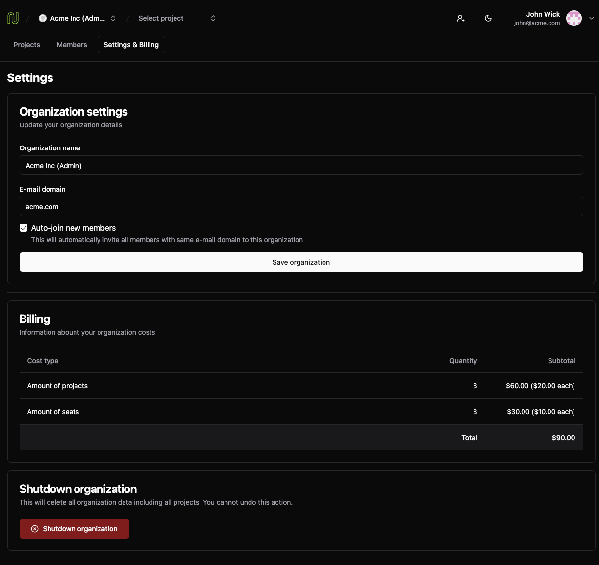

# nivo

<p float="left">
   &nbsp;
   &nbsp;
   &nbsp;
   &nbsp;
   &nbsp;
   &nbsp;
   &nbsp;
   &nbsp;
   &nbsp;
   
</p>


## 🎯 Overview

**Nivo** is a multi-tenant SaaS platform featuring organization management, project collaboration, and enterprise-grade security. Built with modern technologies and deployed on AWS EKS with full CI/CD automation.

### ✨ Key Features

| Feature | Description | Business Value |
|---------|-------------|----------------|
| 🏢 **Multi-Tenant Organizations** | Domain-based user attachment with custom branding | Scalable B2B SaaS model |
| 🔐 **Advanced RBAC** | Three-tier permission system (ADMIN, MEMBER, BILLING) | Enterprise security compliance |
| 📋 **Project Management** | Owner-based access controls with team collaboration | Enhanced productivity |
| 👥 **Team Collaboration** | Invitation system with role-based access | Streamlined onboarding |
| 🔑 **Dual Authentication** | GitHub OAuth + email/password | Flexible user access |
| 💳 **Billing Infrastructure** | Ready for subscription management | Revenue generation ready |

## 🏗️ Architecture

### 📁 Monorepo Structure
```
nivo/
├── apps/
│   ├── api/     # Fastify REST API with OpenAPI
│   └── web/     # Next.js 15 App Router frontend
├── packages/
│   ├── auth/    # Shared CASL authorization
│   └── env/     # Type-safe environment management
├── iac/         # Terraform infrastructure
└── .github/     # CI/CD with OIDC
```

### 🛠️ Technology Stack

| 🖥️ **Frontend** | ⚙️ **Backend** | ☁️ **Infrastructure** |
|------------------|-----------------|----------------------|
| Next.js 15 + React 19 RC | Fastify + TypeScript + Prisma ORM | Kubernetes (EKS) with auto-scaling |
| Radix UI + Tailwind CSS | PostgreSQL with advanced indexing | Terraform IaC with remote state |
| TanStack Query + Intercepting Routes | JWT authentication + OpenAPI documentation | Docker multi-stage builds |
| Dark/light theme system | Zod validation + CASL authorization | GitHub Actions CI/CD with OIDC |
| TypeScript + ESLint + Prettier | Health checks + Error handling | AWS: ECR, EKS, VPC, Secrets Manager |

## 📱 App Experience

### 🏗️ Projects Dashboard

*Central hub for project management with card-based layout, owner information, and creation timestamps. Features role-based access controls and seamless project creation workflow.*

### 👥 Team Management

*Comprehensive member management with role-based permissions, active invites system, and ownership transfer capabilities. Includes avatar display and granular access controls.*

### 💳 Billing & Analytics

*Transparent cost breakdown showing project and seat-based pricing with real-time calculations. Enterprise-ready billing infrastructure with detailed usage metrics.*

## ☁️ Infrastructure

### 🏗️ Cloud Architecture


### 🚀 Performance & Scalability

| Metric | Value | Business Impact |
|--------|-------|-----------------|
| **Response Time** | < 100ms API response | Enhanced user experience |
| **Auto-scaling** | 2-5 pods based on load | Cost optimization |
| **Availability** | Multi-AZ deployment | 99.9% uptime SLA |
| **Security** | Enterprise-grade defense in depth | Compliance ready |

## 🔐 Security

### 🛡️ Simple & Powerful Authorization

The CASL-based authorization system is **extremely easy to use and extend**:

```typescript
// ✅ Create ability for any user - works everywhere!
const ability = defineAbilityFor({ id: userId, role: 'MEMBER' })

// ✅ Check permissions with simple API
if (ability.can('update', 'Project', { ownerId: user.id })) {
  // User can update this specific project
}

if (ability.can('transfer_ownership', organization)) {
  // Show transfer ownership button
}

// ✅ Conditional UI based on permissions
{ability.can('delete', 'User') && (
  <Button>Remove Member</Button>
)}

// ✅ Adding new permissions is trivial
MEMBER(user, { can }) {
  can('create', 'Project')
  can('update', 'Project', { ownerId: { $eq: user.id } })
  // ✨ New permission: just one line!
  can('invite', 'Project', { ownerId: { $eq: user.id } })
}
```

**Why is it so easy?**
- 🎯 **One API**: Same `defineAbilityFor()` works in any app
- 🔄 **Reusable**: Same rules work everywhere (frontend, backend, server actions)
- 🚀 **Extensible**: Add new permissions without breaking existing ones
- 🛡️ **Type-safe**: TypeScript ensures you don't make mistakes

### 🔒 Security Features Matrix

| Security Layer | Implementation | Business Benefit |
|----------------|----------------|------------------|
| **Authentication** | GitHub OAuth + Email/Password | Flexible user access |
| **Authorization** | CASL-based RBAC with 3 roles | Enterprise compliance |
| **Data Protection** | JWT with secure expiration | Session security |
| **Container Security** | Non-root users, read-only filesystems | Runtime protection |
| **Network Security** | Kubernetes Network Policies | Micro-segmentation |
| **Secrets Management** | AWS Secrets Manager integration | Centralized credential management |


## 🗄️ Database Design


## 📊 API & Development

### 🔌 RESTful API with OpenAPI

```typescript
// Type-safe route definitions with Zod validation
app.post('/organizations/:slug/projects', {
  schema: {
    body: z.object({ name: z.string(), description: z.string() }),
    response: { 201: z.object({ projectId: z.string().uuid() }) }
  }
}, async (request, reply) => {
  // Implementation with authorization checks
})
```

### 🛠️ API Features Matrix

| Feature | Technology | Business Value |
|---------|------------|----------------|
| **Type Safety** | Zod schemas + TypeScript | Reduced bugs, better DX |
| **Documentation** | OpenAPI + Swagger UI | Developer onboarding |
| **Authentication** | JWT middleware | Secure API access |
| **Health Monitoring** | Kubernetes endpoints | Production reliability |
| **Validation** | Request/response schemas | Data integrity |

### 🚀 Development Experience

**Modern development workflow with excellent tooling:**

- 🏗️ **Monorepo**: Turbo build system for fast, efficient builds
- 📦 **Shared Packages**: Reusable auth and environment management
- 🔧 **Type-safe Configuration**: End-to-end TypeScript validation
- 🐳 **Docker Compose**: One-command local development setup
- 🗄️ **Prisma Studio**: Visual database management
- 🚀 **CI/CD Pipeline**: Automated testing, quality checks, and security scanning

## 🚀 Getting Started

### 📋 Prerequisites

| Tool | Version | Purpose |
|------|---------|---------|
| **Node.js** | 18+ | Runtime environment |
| **Docker** | Latest | Containerization |
| **Docker Compose** | Latest | Local development |
| **AWS CLI** | Latest | Production deployment |

### 🛠️ Local Development

```bash
# 1. Clone and install dependencies
git clone <repository>
cd nivo
npm install

# 2. Start local database
docker-compose up -d

# 3. Run database migrations and seed
cd apps/api
npm run db:migrate
npm run db:seed

# 4. Start development servers
npm run dev
```

### ☁️ Production Deployment

```bash
# 1. Deploy infrastructure
cd iac
terraform init
terraform apply

# 2. CI/CD handles application deployment automatically
# Push to master branch triggers full deployment pipeline
```

### 🎯 Quick Start Commands

| Command | Purpose | Output |
|---------|---------|--------|
| `npm run dev` | Start development servers | Frontend + API |
| `npm run build` | Build for production | Optimized bundles |
| `npm run lint` | Code quality checks | ESLint reports |
| `npm run db:studio` | Database management | Prisma Studio UI |

## 📈 Performance & Scale

### 🚀 Performance Metrics

| Metric | Value | Business Impact |
|--------|-------|-----------------|
| **API Response Time** | < 100ms | Enhanced user experience |
| **Auto-scaling Range** | 2-5 pods based on load | Cost optimization |
| **Availability** | Multi-AZ deployment | 99.9% uptime SLA |
| **Security Grade** | Enterprise-grade | Compliance ready |

### 🎯 Business Value Proposition

**For Technical Teams:**
- ✅ **Modern Stack**: Latest technologies with best practices
- ✅ **Type Safety**: End-to-end TypeScript for reliability
- ✅ **Scalable Architecture**: Cloud-native design for growth
- ✅ **Developer Experience**: Excellent tooling and documentation

**For Business Stakeholders:**
- ✅ **Enterprise Security**: RBAC, OIDC, and compliance-ready
- ✅ **Cost Effective**: Auto-scaling and resource optimization
- ✅ **Production Ready**: Battle-tested infrastructure
- ✅ **Future Proof**: Modern architecture for long-term success


